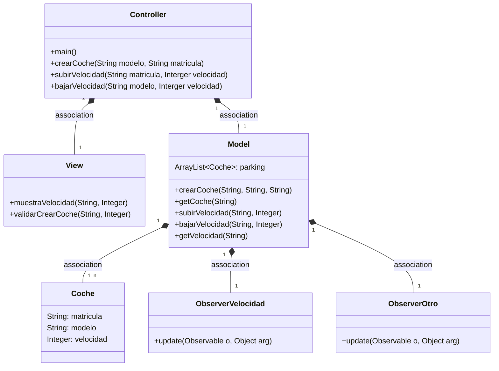
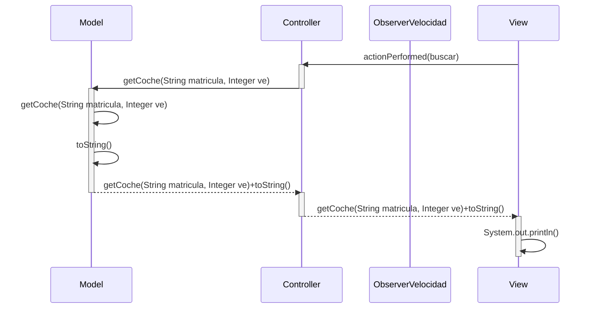

# Arquitectura MVC

Aplicación que trabaja con objetos coches, modifica la velocidad y la muestra

---
## Diagrama de clases:

---

## Diagrama de Secuencia

Ejemplo básico del procedimiento, con los nombres de los métodos

## Pasos que hice para cambiar el codigo

Para crear una rama con git branch 'ex3',
hacer checkout a la rama nueva,
tendre que hacer cambios en las ramas por tener la rama con velocidad subir y bajar diferente
a la de la interface,
agregar los metodos de subir, bajar y buscar en el controller para respetar a MVC,
cada uno llama a los metodos con nombre correspondiente en model, buscar a getCoche y con un
sout para que los muestre,
agregar los eventos de subir, bajar y buscar en la UI para respetar a MVC y que se vea